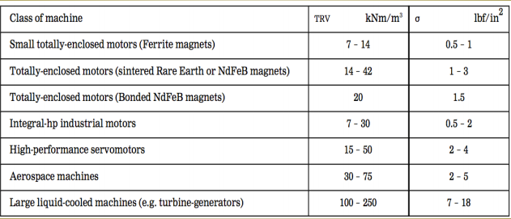

##  Primary Focus
Focus on designing electrical machines to produce torque efficiently rather
than focusing on producing power

##  Sizing of electrical machines using torque/rotor volume & gap stress
Machines are primarily sized for rated torque capability (not power).
Output torque is proportional to product of rotor volume & shear stress
Air-gap shear stress is proportional to product of air-gap electrical &
magnetic loading.
Many IM & RSM machines are 4 pole so most of the rotor volume is
magnetically active.
Perhaps the best sizing parameter for IMs & RSMs is `TRV`
Brushless or PMSM machines tend to have higher poles (8 or more)
The best sizing parameter for PMSMs is probably `air gaps stress`.

`TRV = Torque / Rotor Volume (active).` TRV is related to air-gap shear stress.

##  Rotor OD & Stator OD
Most all new design tasks of new machines begin with a known or
given maximum stator core diameter.
Start the design with an assumed rotor diameter based upon the
number of poles from chart below.

| Poles   	| 2  	| 4  	| 6  	| 8  	| 10 	| 12 	|
|---------	|----	|----	|----	|----	|----	|----	|
| R/S (%) 	| 50 	| 53 	| 56 	| 60 	| 65 	| 70 	|

##  Suggested TRV & gap stress sizing guidelines

